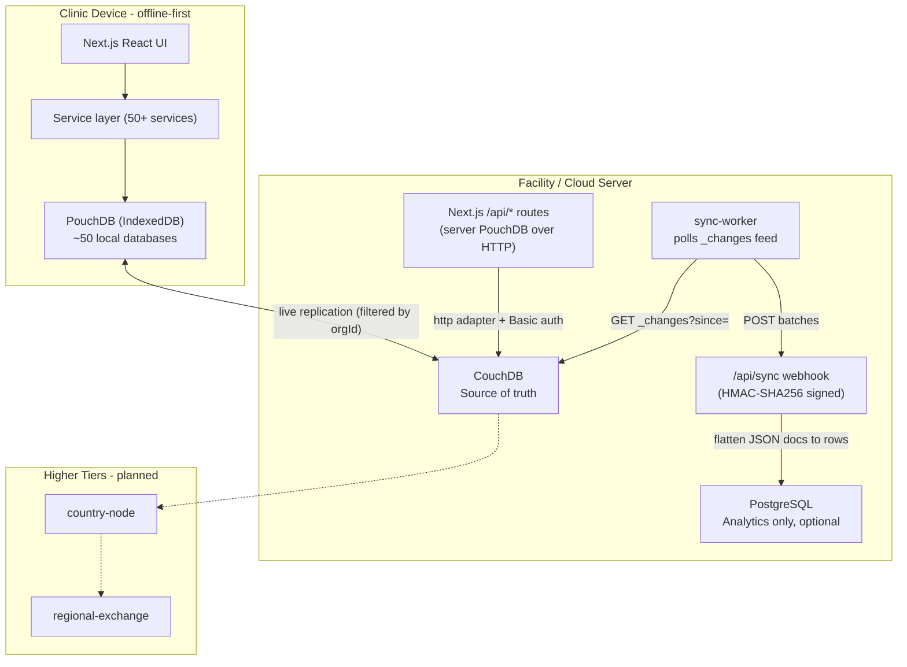
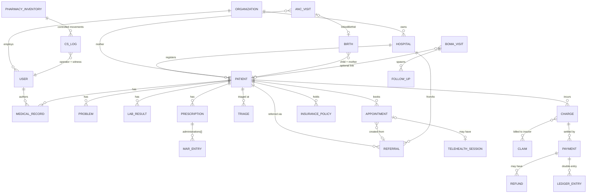

# TamamHealth Data Architecture

> How data is stored, synced, secured, and projected across the stack.
> Source-of-truth files: `platform/src/lib/db.ts` (database accessors),
> `platform/src/lib/sync/sync-config.ts` (sync policy),
> `platform/src/lib/db-types*.ts` (document schemas),
> `platform/src/lib/db/migrations/` (analytics tables).
>
> See [PRINCIPLES.md](PRINCIPLES.md) for the rules this architecture enforces.

---

## The big picture



| Layer | Store | Role | Can be lost? |
|---|---|---|---|
| 1 | PouchDB (browser IndexedDB) | Operational truth at the point of care; works fully offline | Re-replicates from CouchDB |
| 2 | CouchDB | Durable hub; multi-device + multi-facility sync | **No — source of truth** |
| 3 | PostgreSQL | Read-only analytics projection | Yes — rebuildable from `_changes` |
| 4 | country-node / regional-exchange | National rollup (early stage) | n/a |

Key properties:

- **Write path is always local-first.** UI → service → PouchDB → background
  replication. No network call blocks a clinical workflow.
- **One API for two runtimes.** `getDB()` in `db.ts` returns a local
  IndexedDB-backed PouchDB in the browser, and an HTTP-adapter PouchDB
  pointed at CouchDB on the server, so the service layer is runtime-agnostic.
- **The app boots with nothing else running.** Demo mode seeds all local
  databases in the browser (`db-seed.ts`, `SEED_VERSION` in `db.ts`).

---

## Database catalog

All documents extend `BaseDoc` (`_id`, `_rev`, `createdAt`, `updatedAt`,
`createdBy`, `countryId`), carry a `type` discriminator, and — when synced —
an `orgId` tenant key.

Sync directions (`sync-config.ts`):

- **both** — bidirectional live replication
- **push** — client → server only (append-only trails)
- **pull** — server → client only (admin-managed reference data)

### Core clinical

| Database | Doc type | Relationships (id references) | Sync | Org-scoped | Postgres table |
|---|---|---|---|---|---|
| `tamamhealth_patients` | `patient` | orgId → organizations; registration/lastVisit hospital | both | yes | `patients` |
| `tamamhealth_medical_records` | `medical_record` | patientId; hospitalId | both | yes | `medical_records` |
| `tamamhealth_referrals` | `referral` | patientId; fromHospitalId / toHospitalId | both | yes | `referrals` |
| `tamamhealth_lab_results` | `lab_result` | patientId; hospitalId; orderedBy → users | both | yes | `lab_results` |
| `tamamhealth_prescriptions` | `prescription` | patientId; admissionId → wards; witnessId → users; embeds `administrations[]` (MAR, append-only) | both | yes | `prescriptions` |
| `tamamhealth_problems` | `problem` | patientId; sourceEncounterId → medical_records | both | yes | `problems` |
| `tamamhealth_triage` | `triage` | patientId; triagedBy / handoffTo → users; facilityId | both | yes | `triage_events` |
| `tamamhealth_disease_alerts` | `disease_alert` | reportedBy → users | both | **no** (cross-org surveillance) | `disease_alerts` |
| `tamamhealth_hospitals` | `hospital` | orgId; `facilityLevel`: boma/payam/county/state/national | both | yes | `hospitals` |
| `tamamhealth_appointments` | `appointment` | patientId; providerId → users; referralId; previousAppointmentId (follow-up chain) | both | yes | `appointments` |
| `tamamhealth_availability` | `availability` | providerId → users; facilityId | both | yes | — |
| `tamamhealth_telehealth` | `telehealth_session` | appointmentId; patientId; providerId | both | yes | `telehealth_sessions` |
| `tamamhealth_messages` | `message` | patient or staff recipient; fromDoctorId → users | both | yes | `messages` |
| `tamamhealth_announcements` | `announcement` | authorId → users; targetRoles[] | both | yes | — |

### Vital events & public health (CRVS / MCH / community)

| Database | Doc type | Relationships | Sync | Org-scoped | Postgres table |
|---|---|---|---|---|---|
| `tamamhealth_births` | `birth` | childPatientId, motherPatientId → patients; linkedAncMotherId → anc | both | yes | `births` |
| `tamamhealth_deaths` | `death` | patientId; facilityId; WHO ICD-11 cause chain | both | yes | `deaths` |
| `tamamhealth_immunizations` | `immunization` | patientId; facilityId | both | yes | `immunizations` |
| `tamamhealth_anc` | `anc_visit` | motherId/patientId → patients; linkedBirthId → births (bidirectional link) | both | yes | `anc_visits` |
| `tamamhealth_boma_visits` | `boma_visit` | patientId (optional); workerId → users; referredTo → hospitals | both | yes | `boma_visits` |
| `tamamhealth_follow_ups` | `follow_up` | patientId; assignedWorker → users; sourceVisitId → boma_visits | both | yes | `follow_ups` |
| `tamamhealth_facility_assessments` | `facility_assessment` | facilityId → hospitals | both | yes | `facility_assessments` |

### Operational / facility

| Database | Doc type | Relationships | Sync | Org-scoped | Postgres table |
|---|---|---|---|---|---|
| `tamamhealth_pharmacy_inventory` | `pharmacy_inventory` | hospitalId; `controlledSchedule` I–V, `requiresWitness` | both | yes | `pharmacy_inventory` |
| `tamamhealth_wards` | ward/admission docs | patient/hospital ids | both | yes | `wards` |
| `tamamhealth_blood_bank` | `blood_bank` | donorId, reservedForPatient, transfusedTo → patients | both | yes | `blood_bank` |
| `tamamhealth_emergency_plans` | `emergency_plan` | facilityId; activatedBy → users | both | yes | `emergency_plans` |
| `tamamhealth_assets` | asset docs | facilityId | both | yes | `assets` |
| `tamamhealth_staff_schedules` | `staff_schedule` | userId, swappedWith → users; facilityId | both | yes | `staff_schedules` |
| `tamamhealth_leave_requests` | leave docs | userId → users | both | yes | `leave_requests` |
| `tamamhealth_payroll_entries` | payroll docs | userId → users | both | yes | `payroll_entries` |
| `tamamhealth_patient_feedback` | feedback docs | patientId; facilityId | both | yes | `patient_feedback` |

### Billing / payments / insurance

| Database | Relationships | Sync | Org-scoped | Postgres table |
|---|---|---|---|---|
| `tamamhealth_billing` | patientId; encounter ids | both | yes | `billing` |
| `tamamhealth_fee_schedule` | admin-published price catalog | **pull** | yes | `fee_schedule` |
| `tamamhealth_insurance_policies` | patientId; payer | both | yes | `insurance_policies` |
| `tamamhealth_eligibility_checks` | policyId, patientId | both | yes | `eligibility_checks` |
| `tamamhealth_charges` | patientId, encounter, fee item | both | yes | `charges` |
| `tamamhealth_claims` | policyId, charges | both | yes | `claims` |
| `tamamhealth_adjustments` | chargeId / claimId | both | yes | `adjustments` |
| `tamamhealth_payments` | invoiceId / chargeId, patientId | both | yes | `payments` |
| `tamamhealth_refunds` | paymentId | both | yes | `refunds` |
| `tamamhealth_saved_payment_methods` | patientId (tokenized) | both | yes | — |
| `tamamhealth_payment_plans` | patientId, balance | both | yes | `payment_plans` |
| `tamamhealth_invoices` | charges, patientId | both | yes | `invoices` |
| `tamamhealth_ledger` | double-entry rows referencing payments/charges | **push** (append-only) | yes | `ledger_entries` |

### Identity, config & audit (trust-boundary databases)

| Database | Doc type | Sync | Org-scoped | Why this direction |
|---|---|---|---|---|
| `tamamhealth_users` | `user` | **pull** | yes | Clients must never mint/modify accounts; admin-managed server-side |
| `tamamhealth_organizations` | `organization` | **pull** | no | Tenant registry pushed down to all clients |
| `tamamhealth_platform_config` | `platform_config` | **pull** | no | Platform-level, super_admin-only writes |
| `tamamhealth_audit_log` | `audit_log` | **push** | yes | Tamper-resistance: clients can't receive/rewrite history |
| `tamamhealth_controlled_substance_log` | `controlled_substance_log` | **push** | yes | Legal append-only record; two signatures (operator + witness, SSDFCA rule) |
| `tamamhealth_sync_events` | `sync_event` | **push** | yes | Outbox of every clinical mutation |
| `tamamhealth_conflict_queue` | `conflict_queue` | both | yes | High-risk PouchDB conflicts held for human resolution |
| `tamamhealth_meta` | seed marker | not synced | local | Browser-local demo seed flag (`SEED_VERSION`) |

---

## Entity relationships (core)

These are application-level references (string id fields) maintained by the
service layer in `platform/src/lib/services/` — PouchDB/CouchDB enforces no
foreign keys.



---

## Access control — defense in depth

Roles and their route/data access are documented in
[RBAC-MATRIX.md](RBAC-MATRIX.md). The enforcement layers:

| Layer | Mechanism | File |
|---|---|---|
| Route access | Role → allowed-route table, checked identically in Edge middleware + server + client | `platform/src/lib/role-routes.ts`, `permissions.ts` |
| Data scoping (reads) | `filterByScope()` — orgId always; payam scope for supervisors; hospitalId for non-admin roles | `platform/src/lib/services/data-scope.ts` |
| API auth | JWT payload → `buildScopeFromAuth()`; HMAC signature on `/api/sync` | `api-auth.ts`, `api-security.ts` |
| Replication scope | Per-DB `orgScoped` flag — clients replicate only their org's partition | `sync/sync-config.ts` |
| CouchDB write guard | `validate_doc_update`: requires `orgId` on every doc, rejects mismatch with the user's `org:<id>` CouchDB role, makes `orgId` immutable | `sync/validate-doc-update.ts` |
| Append-only domains | Push-only sync; corrections are new rows, never edits | `sync-config.ts`, `db-types.ts` |
| Two-person control | Controlled substances (Schedule II–V): operator + witness signature on every movement | `ControlledSubstanceLogDoc` |
| PHI scrubbing | `stripPHI()` `beforeSend` hook removes patient data from error reports | `observability.ts` |

Special permission lists in `permissions.ts`:

- `CONFLICT_RESOLUTION_ROLES`: `super_admin`, `org_admin`,
  `medical_superintendent`, `hrio` — the only roles that may act on the
  conflict queue.
- Private-sector orgs exclude government/community roles
  (`getAvailableRoles()`).

---

## Analytics pipeline (optional tier)

```
PouchDB ──replication──► CouchDB ──_changes──► sync-worker ──HMAC POST──► /api/sync ──► PostgreSQL
```

- `sync-worker/index.mjs` polls each database's `_changes` feed, tracks a
  per-database last-seen `seq`, and POSTs batches signed with HMAC-SHA256
  (`x-tamamhealth-signature`).
- `/api/sync` verifies the signature and flattens JSON documents into the
  ~45 relational tables created by `platform/src/lib/db/migrations/`
  (`0001`–`0005`), plus `sync_metadata` (checkpoint per database).
- If `DATABASE_URL` is unset, migrations are skipped at startup
  (`instrumentation.ts`) and the tier simply does not exist. Nothing in the
  operational path notices.

## Adding a new data domain (checklist)

1. Define the document interface in `db-types.ts` (or a `db-types-<domain>.ts`
   split). Extend `BaseDoc`, add a `type` discriminator and `orgId`.
2. Add a typed accessor in `db.ts` (`export const fooDB = () => getDB('tamamhealth_foo')`).
3. Add a `DATABASE_SYNC_CONFIGS` entry in `sync-config.ts` with a justified
   direction and `orgScoped` flag (see [PRINCIPLES.md](PRINCIPLES.md) §5).
4. Add the database name to `resetAllDatabases()` in `db.ts` and, if demo
   data is needed, to `db-seed.ts` (bump `SEED_VERSION`).
5. Create a service in `services/` — components never touch `getDB()` directly.
6. Optional analytics: add a migration in `db/migrations/` and a mapping in
   the `/api/sync` route's `DB_TABLE_MAP`.
