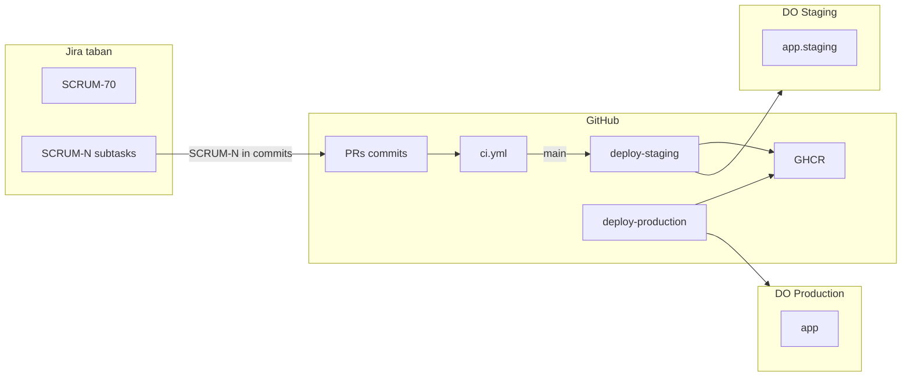

# Jira ↔ GitHub ↔ DigitalOcean tracking

Operator guide for tracing work from Jira tickets through GitHub CI/CD to
staging and production droplets on DigitalOcean.

**Related:** [Jira backlog (SCRUM-70 epic)](../JIRA-DEPLOY-BACKLOG.md),
[DigitalOcean infra](../../infra/digitalocean/README.md),
[GitHub for Jira setup](./github-for-jira-setup.md),
[GitHub Environments secrets](./github-environments-setup.md),
[Secrets (Doppler)](./secrets.md).

---

## Systems and roles

| System | Role in tracking |
|--------|------------------|
| **Jira** (`taban.atlassian.net`, project **SCRUM**) | Work items — epic SCRUM-70, phase stories, subtasks |
| **GitHub** (`makuachteny/TamamHealth`) | Code, PRs, CI, GHCR images, deploy workflows |
| **DigitalOcean** | Two droplets — **staging** (auto) + **production** (manual promote) |

---

## Environment matrix

| | Local dev | Staging (DO) | Production (DO) |
|---|-----------|--------------|-----------------|
| **Purpose** | Feature work | Auto-deploy smoke / demo | Pre-pilot (no in-country PHI long-term) |
| **Host** | localhost | Staging droplet, 4 GB, FRA1 | Prod droplet, 8 GB+ |
| **DNS** | — | `app.staging.<domain>`, `couch.staging.<domain>` | `app.<domain>`, `couch.<domain>` |
| **GitHub Environment** | — | `staging` | `production` (required reviewers) |
| **GHCR tag** | local build | `:staging` + `:<sha>` | `:production` + `:<sha>` |
| **Doppler config** | `dev` | `stg` | `prd` |
| **`IMAGE_TAG` on droplet** | — | `staging` | `production` |
| **Deploy trigger** | `npm run dev` | Push to `main` after green CI | Manual `deploy-production` workflow |
| **Demo mode** | optional | `NEXT_PUBLIC_DEMO_MODE=true` | `false` |

Append the right file on each droplet:

- Staging: [`infra/digitalocean/staging.env.append`](../../infra/digitalocean/staging.env.append)
- Production: [`infra/digitalocean/production.env.append`](../../infra/digitalocean/production.env.append)

---

## Architecture



---

## Traceability chain

| Layer | What you track | Where |
|-------|----------------|-------|
| Work | Epic, stories, subtasks | [SCRUM board](https://taban.atlassian.net/jira/software/projects/SCRUM/boards) |
| Code | PR, commit SHA, CI | GitHub → Actions |
| Artifact | `:staging`, `:production`, `:<sha>` | GitHub → Packages (GHCR) |
| Runtime | Live image tag + SHA | Droplet: `docker compose … images`; Actions log: `Deployed sha=…` |

---

## Daily workflow (developers)

1. Pick a Jira subtask (e.g. **SCRUM-98**).
2. Branch: `feat/SCRUM-98-short-description`.
3. Commit: `SCRUM-98 Add docker-compose.ghcr.yml override`.
4. Open PR — title includes `SCRUM-98`; body can include `Closes SCRUM-98`.
5. CI green → merge to `main`.
6. **deploy-staging** runs → staging droplet pulls `:staging`.
7. Smoke-test `https://app.staging.<domain>`.
8. Move Jira subtask to **Done**; comment with deployed SHA if useful.
9. To promote: **Actions → deploy-production → Run workflow** (`target: vps`, optional SHA).
10. Approver confirms in GitHub **production** environment → prod droplet pulls `:production`.

See [Smart commits & PR conventions](../CONTRIBUTING.md#jira-integration-smart-commits).

---

## GHCR compose (required for CI deploy)

Root [`docker-compose.yml`](../../docker-compose.yml) builds from source. CI uses
[`docker-compose.ghcr.yml`](../../docker-compose.ghcr.yml):

```bash
export GH_OWNER=makuachteny IMAGE_TAG=staging   # or production
docker compose -f docker-compose.yml -f docker-compose.ghcr.yml pull
docker compose -f docker-compose.yml -f docker-compose.ghcr.yml up -d
```

GitHub Actions pass `IMAGE_TAG` inline on SSH deploy; droplets should also persist
`GH_OWNER`, `IMAGE_TAG`, and `COMPOSE_FILE` in `.env`.

---

## Verify what's deployed

**GitHub Actions:** workflow log line `Deployed sha=abc1234 tag=staging|production`.

**On droplet:**

```bash
cd /opt/tamamhealth
docker compose -f docker-compose.yml -f docker-compose.ghcr.yml ps
docker compose -f docker-compose.yml -f docker-compose.ghcr.yml images
```

**GHCR:** Package tags under `ghcr.io/makuachteny/tamamhealth-platform` (and website, sync-worker).

**Jira (manual):** Comment on SCRUM-95 / SCRUM-101 with environment URL + SHA after deploy.

---

## Setup checklist (one-time)

| Step | Doc |
|------|-----|
| Install GitHub for Jira | [github-for-jira-setup.md](./github-for-jira-setup.md) |
| Provision two DO droplets | [infra/digitalocean/README.md](../../infra/digitalocean/README.md) |
| GitHub `staging` + `production` secrets | [github-environments-setup.md](./github-environments-setup.md) |
| Doppler `stg` + `prd` tokens on droplets | [secrets.md](./secrets.md) |
| Jira backlog (done) | [SCRUM-70](https://taban.atlassian.net/browse/SCRUM-70) |

---

## Verify CI/CD pipeline (after secrets wired)

```bash
# From repo root — static checks (no SSH required)
./scripts/verify-deploy-pipeline.sh
```

Manual end-to-end:

1. Push a trivial commit to `main` with `SCRUM-N` in the message.
2. Confirm **ci** → **deploy-staging** succeed.
3. Confirm staging droplet shows new image tag.
4. Run **deploy-production** with `target: vps`; confirm prod droplet updates.

---

## What is not automated

| Connection | Status |
|------------|--------|
| Jira ↔ GitHub PRs/commits | Requires [GitHub for Jira app](./github-for-jira-setup.md) |
| Jira ↔ deployment SHA | Manual comment (optional automation later) |
| DO droplet provisioning | Manual or future Terraform (`infra/digitalocean/`) |

---

## Residency note

DigitalOcean staging/demo is fine for SCRUM deployment work. Production on DO is
**pre-pilot only** — real PHI belongs in-country or on AWS `af-south-1`
([`docs/AFRICA-HOSTING-STRATEGY.md`](../AFRICA-HOSTING-STRATEGY.md)).
